# 🔤 trigram_lm - a tiny smoothed language-model toolkit

## Problem & Motivation
Character– and word-level *n-gram* language models are a classical
baselines for NLP tasks such as scoring text (perplexity) or generating
synthetic sentences. This repo provides a minimal implementation for fast prototyping and educational use.

## 🏗️ Architecture / Tech Stack
* 🐍 **Python ≥ 3.9** — no heavy ML libraries required  
* 📦 Pure `collections.Counter` counts → Laplace-smoothed probabilities (more on ngram smoothing: https://numpy-ml.readthedocs.io/en/latest/numpy_ml.ngram.html)
* 📚 `src/ngram_model.py` exposes:
  - `CharTrigramModel`
  - `WordTrigramModel`  
  Both inherit from a generic `_BaseNGramModel` (open for extension, closed for bugs)  
* 💻 Command-line UX lives in `src/cli.py` (train / generate / perplexity)

## ⚡ Example: Train → Sample → Evaluate
```bash
python -m src.cli train      --input data/training.en \
                             --output models/char.pkl \
                             --model char --alpha 0.5

python -m src.cli generate   --model models/char.pkl --length 200

python -m src.cli perplexity --model models/char.pkl --input data/heldout.en
```
## ⚙️ Environment / Setup
```bash
python -m venv .venv && source .venv/bin/activate
pip install -r requirements.txt
pytest  # optional smoke-tests
```
## 🖥️ CLI Workflow
Here’s a visual summary of how the command-line interface works.  
You can train a model, generate text, and evaluate its perplexity using three simple subcommands.

```mermaid
graph TD;
    A[User CLI Entry] --> B{Command};
    B --> C[train: read data → train model with alpha smoothing → save .pkl];
    B --> D[generate: load model → output sample text];
    B --> E[perplexity: load model → read file → compute PP score];
```

## 📂 Quickstart Data
* 📘 Europarl (English subset) — used in our example output
  * Download: http://www.statmt.org/europarl/
  * Recommended preprocessing: lowercase, remove XML markup, one sentence per line
* 📚 Project Gutenberg — public domain books for stylistic generation
	*	Browse: https://www.gutenberg.org/
	*	Tip: Use plain text UTF-8 downloads, strip headers/footers
*	📝 Wikitext-2 (Hugging Face) — well-formatted Wikipedia-style text
	*	Dataset page: https://huggingface.co/datasets/wikitext
	*	Direct link: https://huggingface.co/datasets/wikitext/viewer/wikitext-2-raw-v1/train
*	🌍 Common Crawl (via OSCAR or CCNet) — large-scale web crawl text
	* OSCAR dataset (multilingual, deduplicated Common Crawl): https://oscar-corpus.com/
	* CCNet (preprocessed version of Common Crawl by FAIR): https://github.com/facebookresearch/cc_net

Place training data in the data/ directory (e.g., data/training.en), and optionally split out a validation or held-out set as data/heldout.en.

## ✨ Sample Output
```bash
e. the cost of the proposed measure is not in line with our budget.
mr president i believe we should therefore postpone the vote .
```
(Generated by the word-trigram model trained on ~2 MB of Europarl)

## 📊 Key Results

| 🧩 Model  | 📖 Corpus |  🔧 α (Laplace)  | 📉 Perplexity ↓ |
| ------------- | ------------- | ------------- | ------------- |
| Char-trigram (ours)  | 1 MB English  | 0.5  | 28.3  |
| Word-trigram (baseline)  | same corpus  | 1.0  | 72,483  |

The character-level trigram model reduced model surprise (perplexity) from ~1600 (word-level) to 28, consistent with values reported in classical NLP literature (~20–50).

## ♻️ Re-use
Everything is MIT-licensed.  You can either drop src/ into your own projects, or install from a local clone:
```bash
pip install -e .
```
Happy language-modelling! 🤖


